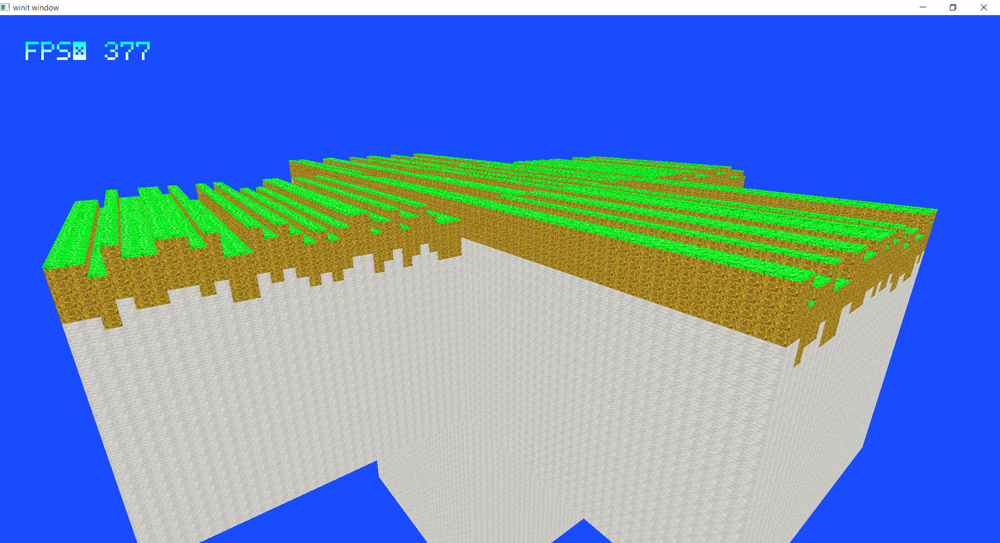

# Mineblock
This is based off the game Minecraft programmed in Rust using Vulkano as the wrapper around the Vulkan API.

 

## General Info
A game called Mineblock which was heavily inspired by Minecraft. And the reason I chose to use
Vulkano, a wrapper around a low-level GPU API, was to get my hands wet to understand each parts
how GPU works.  
This is mainly me exploring terrain generation and near realistic weather systems and natural
environment through easily rendered blocks.

### Future Development
This is considered as my primary hobby project, so expect continuous development over the years.
I'm currently thinking putting this game mainly for weathers and biome generation with little to
no gameplay. And hopefully to fork this for my another project related to this.

### Current Status
Currently having 6 chunks with two pairs of chunks going on either way of their
respective axis and on below the central chunk. Also has a FPS reader on it to
easily see performance bottlenecks.

## Tutorial
W - move forward  
A - go left  
S - move backward  
D - go right  
LSHIFT - move downward  
SPACE - move upward

[Esc] - Pause Menu  
[F1] - Game Info  
[F2] - Debug Info & Game Info
[F3] - Show Debug in the World (Chunk Borders, ...)

Temporary:  
T - to escape the mouse lock

